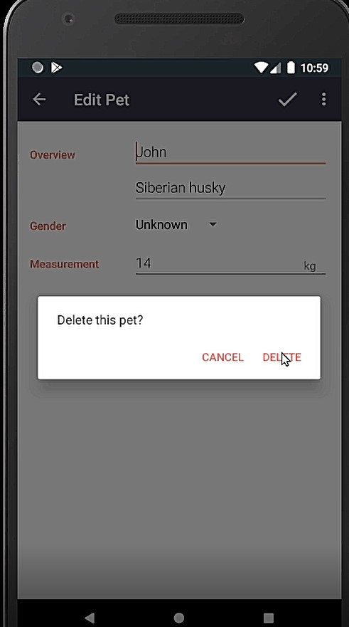
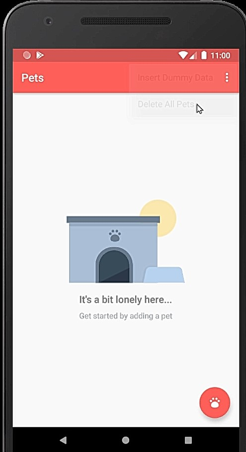

#Pets App

This app displays a list of pets and their related data that the user inputs. I learned to build this app in a Udacity course ([Android Basics: Data Storage] (https://www.udacity.com/course/android-basics-data-storage--ud845)).

In this course, I learned about the importance of data persistence when building an Android app. I was introduced to the fundamentals of SQL, the programming language needed to interact with an SQLite relational database. SQLite is a commonly used method to store large sets of data locally on an Android device. I also learned how to work with Content Providers, which help my data storage to be bug free and to be shared with other apps.

Screenshots
-----------

